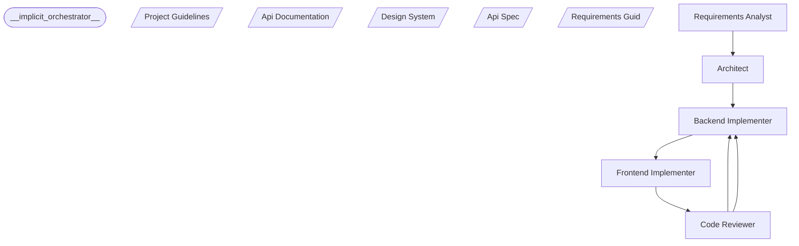

# Architecture

## Workflow Structure



## Agents

### __implicit_orchestrator__
- Agent: @__implicit_orchestrator__
- Output: N/A
- Model: sonnet

### Requirements Analyst
- Agent: @requirements-analyst
- Output: N/A
- Model: opus

### Architect
- Agent: @architect
- Output: N/A
- Model: opus

### Backend Implementer
- Agent: @backend-implementer
- Output: N/A
- Model: sonnet

### Frontend Implementer
- Agent: @frontend-implementer
- Output: N/A
- Model: sonnet

### Code Reviewer
- Agent: @code-reviewer
- Output: N/A
- Model: opus

## Data Flow

1. **Input**: User provides task description
2. **Analysis**: Orchestrator analyzes and decomposes the task
3. **Delegation**: Tasks are assigned to specialist agents
4. **Execution**: Each agent produces their deliverables
5. **Integration**: Results are combined and validated
6. **Output**: Final result is presented to user

## File Structure

```
.claude/
├── commands/
│   └── [command-name].md    # Orchestrator instructions
├── agents/
│   └── [command-name]-*.md  # Specialist agent files
└── CLAUDE.md                # Global instructions

.claude.config/
└── [command-name]/
    ├── docs/                # Documentation
    ├── states/              # Runtime state files
    └── logs/                # Execution logs
```

## Communication Protocol

Agents communicate using structured JSON responses:

```json
{
  "status": "success" | "failure",
  "summary": "Brief description of what was done",
  "files_modified": ["list", "of", "files"],
  "next_steps": ["optional", "recommendations"]
}
```

## Error Handling

- **Agent Failure**: Orchestrator can retry or escalate
- **Validation Failure**: Feedback loop triggers revision
- **Human Approval**: Workflow pauses for human decision
