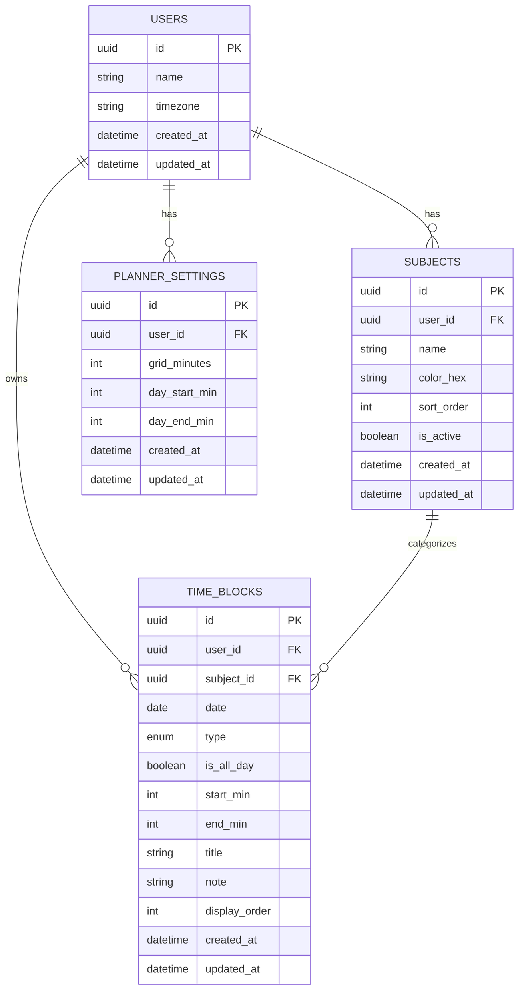
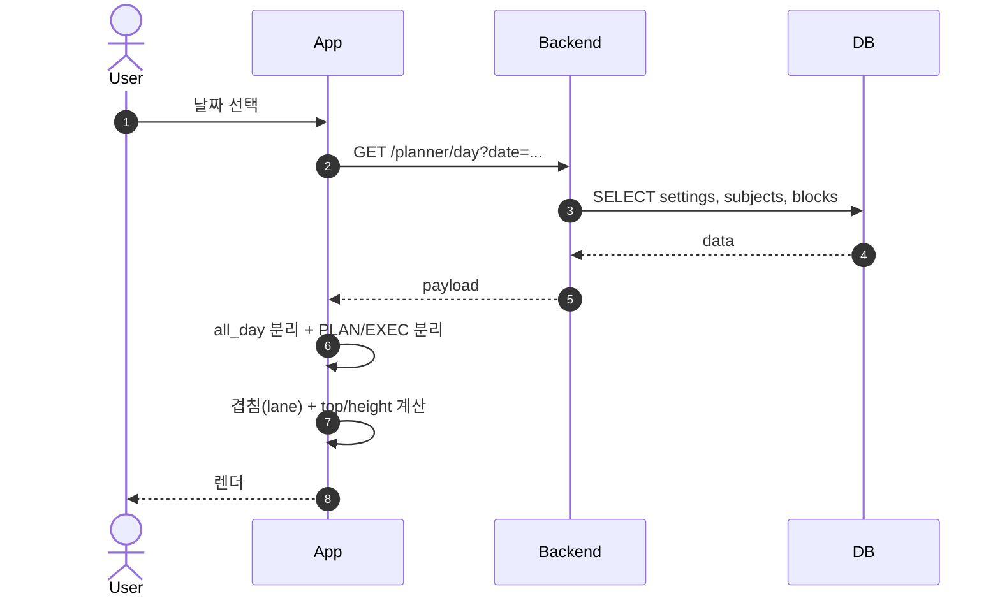
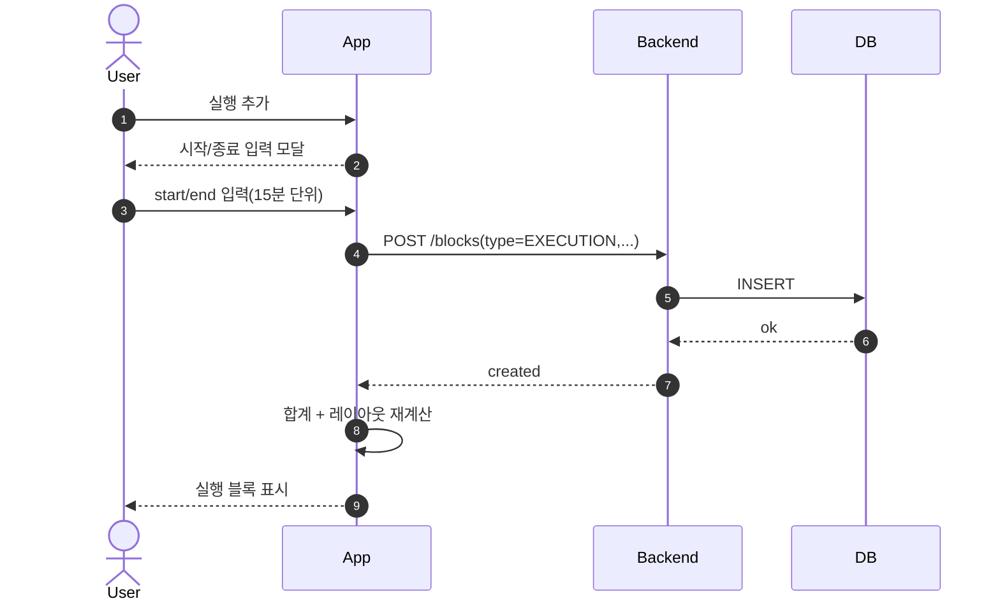
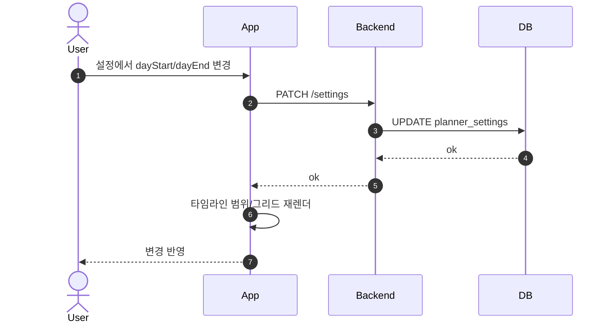
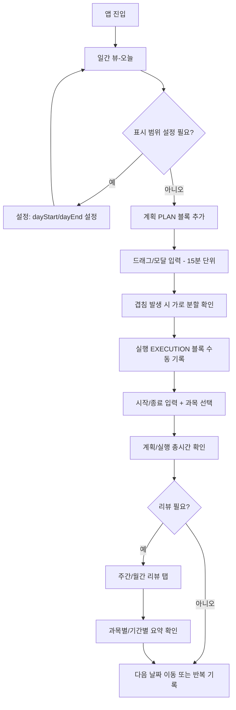

# PRD — 스터디 플래너 (일간 타임라인: 계획/실행 2컬럼)

## 1. 문서 정보

| 항목 | 내용 |
|------|------|
| 제품명(가칭) | Study Planner Timeline |
| 버전 | v1.0 |
| 작성 목적 | "일간 타임라인(계획/실행)" 화면을 구현 가능한 수준으로 요구사항/스키마/플로우를 정의한다. |
| 범위 | 일간 뷰(필수) + 주/월 리뷰(확장) + 오프라인/동기화(확장) |

---

## 2. 배경/문제 정의

사용자는 하루 학습 계획과 실제 수행을 분리하여 기록하고, 하루/주간 단위로 학습 시간을 관리하고 싶다. 기존 체크리스트 방식은 "언제(시간대) 무엇을 했는지"와 "계획 대비 실행"을 동시에 파악하기 어렵다. 따라서 좌측 시간축 기반 타임라인 위에 계획(Plan)과 실행(Execution)을 분리하여 블록 형태로 시각화하는 UI가 필요하다.

---

## 3. 목표 (Goals)

1. 일간 화면에서 계획/실행을 시간축 기반 블록으로 입력·조회할 수 있다.
2. 같은 컬럼 내 일정이 겹쳐도 가로 분할로 안정적으로 표시된다.
3. 사용자가 설정한 하루 표시 범위에 맞춰 그리드/블록 렌더링이 정상 동작한다.
4. 계획/실행의 총 시간을 일자 단위로 즉시 확인할 수 있다.

---

## 4. 비목표 (Non-Goals)

- 자동 타이머 기반 실행 측정 (이번 버전에서는 미포함, 수동 입력만)
- AI 추천, 난이도 분석, 학습 컨텐츠 연동 등 고도화 기능
- 협업/공유 기능 (공동 플래너)

---

## 5. 사용자 및 핵심 시나리오

### 5.1 사용자

- 수험/학습 시간 관리가 필요한 개인 사용자
- 계획을 먼저 세우고, 하루 종료 시 실행 시간을 정리하는 사용자

### 5.2 핵심 시나리오 (사용자 목표 달성 경로)

1. 일간 뷰 진입 → 필요 시 하루 표시 범위 설정
2. 계획(PLAN) 블록 추가 (드래그/모달)
3. 실행(EXECUTION) 블록을 수동 시작/종료 입력으로 기록
4. 일자 합계 (계획/실행 총시간) 확인
5. 주간/월간 리뷰로 이동하여 요약 확인 (확장)

---

## 6. 제품 정책 (선택 사항 확정)

| 정책 | 설정 |
|------|------|
| 그리드 최소 단위 | 15분 |
| 하루 표시 범위 | 사용자 설정 (dayStartMin/dayEndMin) |
| 실행 기록 방식 | 수동 입력 (시작/종료 직접 입력) |
| 겹침 정책 | 겹침 허용 (가로 분할 표시) |

---

## 7. 기능 요구사항 (Functional Requirements)

### 7.1 일간 타임라인 뷰 (필수)

#### FR-1. 날짜 네비게이션
- 사용자는 날짜를 선택/이동할 수 있어야 한다.
- 선택한 날짜의 데이터(설정/과목/블록)가 로딩되어야 한다.

#### FR-2. 레이아웃
- 화면은 (1) 상단 올데이 영역, (2) 하단 타임라인 영역으로 구성된다.
- 타임라인 영역은 좌측 시간축 + 우측 2컬럼(계획/실행)로 구성된다.

#### FR-3. 시간축 (Time Axis)
- 시간축은 사용자가 설정한 하루 범위를 기준으로 렌더링된다.
- 15분 단위 그리드 라인이 존재해야 한다.
- 1시간 단위로 더 강조된 라인/라벨이 표시되어야 한다.
- 시간축은 스크롤 시에도 시각적으로 기준 역할을 한다 (Sticky 권장).

#### FR-4. 블록 렌더링
- 블록은 start/end를 기반으로 top/height가 계산되어야 한다.
- 블록은 과목(Subject) 색상 또는 기본 색상으로 시각 구분된다.
- 블록 내부에 텍스트(제목/설명)가 표시되어야 한다.

#### FR-5. 텍스트 정책 (높이 기반)
- 블록 높이에 따라 표시 텍스트 줄 수/말줄임이 달라져야 한다.
  - **높음**: 제목 + 상세 2줄
  - **중간**: 제목 + 상세 1줄 (말줄임)
  - **낮음**: 제목 1줄 (말줄임) 또는 최소 표현 + 탭 상세

#### FR-6. 겹침 처리 (같은 컬럼 내)
- 같은 컬럼에서 시간이 겹치는 블록은 가로로 분할하여 표시한다.
- 각 블록은 `laneIndex`, `laneCount`를 계산해 다음 규칙으로 배치한다:
  - `width = 100% / laneCount`
  - `left = laneIndex * width`

#### FR-7. 합계 시간 표시
- 상단에 "계획 총 Xh", "실행 총 Yh"를 표시한다.
- 합계는 해당 날짜의 블록들을 기준으로 계산된다.
- `is_all_day=true`는 합계 포함 여부를 정책으로 분리 (기본: 포함하지 않음 권장)

---

### 7.2 블록 CRUD (필수)

#### FR-8. 블록 생성
- 사용자는 PLAN 또는 EXECUTION 컬럼에 블록을 생성할 수 있다.
- 생성 시 입력 값:
  - `type` (PLAN/EXECUTION), `title`, `note` (optional), `subject` (optional)
  - `is_all_day` 여부
  - `is_all_day=false`면 `start/end` 필수
- `start/end`는 15분 단위 스냅을 적용한다.

#### FR-9. 블록 수정
- 사용자는 블록의 제목/설명/과목/시간을 수정할 수 있다.
- 시간 수정은 15분 단위로만 변경 가능하다.

#### FR-10. 블록 삭제
- 사용자는 블록을 삭제할 수 있다.
- 삭제 후 합계/레이아웃(겹침)이 즉시 갱신되어야 한다.

---

### 7.3 실행 기록 방식 (필수: 수동)

#### FR-11. 실행 기록 입력
- 사용자는 EXECUTION 블록을 생성할 때 "시작/종료 시간"을 직접 입력한다.
- 유효성:
  - `start < end`
  - 15분 단위
  - `dayStart/dayEnd` 범위 내 클램프 또는 경고 정책 필요

---

### 7.4 사용자 설정 (필수)

#### FR-12. 하루 표시 범위 설정
- 사용자는 `dayStart/dayEnd`를 설정할 수 있다.
- 설정은 사용자 단위로 저장되고, 일간 뷰 렌더링에 즉시 반영된다.

---

## 8. 추가로 필요한 기능 (확장 기능 후보)

v1에서 "선정"된 추가 기능이며, 시퀀스/유저플로우 기준으로 구현 우선순위를 부여한다.

### 8.1 올데이(상단) 영역 지원 (권장: v1 포함)
- `is_all_day=true` 블록은 상단 영역에 칩/리스트로 표시한다.
- 많아질 경우 더보기/접기 필요.

### 8.2 현재 시간 라인 (권장)
- 현재 시간이 범위 내라면 빨간 라인과 포인터를 표시한다.
- 일정 간 간격 파악에 도움.

### 8.3 주간/월간 리뷰 (확장)
- 기간 합계(계획/실행), 과목별 합계, 달성률을 제공한다.
- 상단 탭(주간리뷰/월스케줄러)와 연동.

### 8.4 오프라인/동기화 (확장)
- 로컬 저장 + pending queue flush로 입력 안정성 강화.

---

## 9. 데이터 모델 (ERD) 및 설명

### 9.1 ERD

### 9.2 주요 필드 정의

| 필드 | 설명 |
|------|------|
| `start_min/end_min` | 분 단위(0~1440). 시간 계산/겹침 계산/정렬에 최적. |
| `type` | PLAN/EXECUTION 분리. |
| `is_all_day` | 상단 영역 표시 여부. |
| `PLANNER_SETTINGS.day_start_min/day_end_min` | 사용자 설정 "하루 범위"를 구현하는 핵심. |

### 9.3 서버 검증 규칙

- **settings**: `0 <= start < end <= 1440`
- **blocks**:
  - `is_all_day=false` → start/end 필수, `start < end`, 15분 단위
  - `is_all_day=true` → start/end nullable(권장) 또는 정렬 목적 값 허용

---

## 10. API 요구사항 (예시)

| Method | Endpoint | 설명 |
|--------|----------|------|
| GET | `/planner/day?date=YYYY-MM-DD` | settings + subjects + blocks 반환 |
| POST | `/blocks` | 블록 생성 |
| PATCH | `/blocks/:id` | 블록 수정 |
| DELETE | `/blocks/:id` | 블록 삭제 |
| GET | `/planner/summary?from=YYYY-MM-DD&to=YYYY-MM-DD` | 주/월 리뷰용 요약 |

---

## 11. 시퀀스 다이어그램 (추가 기능 포함)

### 11.1 일간 화면 로딩

### 11.2 실행(수동 입력) 기록 추가

### 11.3 사용자 하루 범위 설정 반영

---

## 12. 유저 플로우 다이어그램

---

## 13. 비기능 요구사항 (Non-Functional Requirements)

### 13.1 성능
- 일간 뷰 렌더링: 블록 200개까지 스크롤/레이아웃 계산이 버벅이지 않아야 함
- 겹침 계산: O(n log n) 수준(정렬 + 스윕) 권장

### 13.2 일관성/정합성
- 15분 단위 스냅은 클라이언트/서버 모두에서 동일 규칙 적용
- 타임존 기반 날짜 처리 (특히 자정 경계)

### 13.3 접근성 (권장)
- 색상만으로 구분하지 않도록 제목/아이콘/테두리 보조
- 블록 클릭 시 상세 모달은 키보드 포커스 고려 (웹)

---

## 14. 수용 기준 (Acceptance Criteria)

1. 사용자가 설정한 `dayStart/dayEnd`에 맞춰 시간축/그리드가 정확히 표시된다.
2. PLAN/EXECUTION 2컬럼이 명확히 분리되어 보이고, 각 컬럼 합계가 맞다.
3. 블록의 위치/높이가 start/end에 따라 정확히 렌더링된다 (15분 단위).
4. 같은 컬럼 내 겹치는 블록이 가로 분할로 표시되며 서로 겹쳐서 가려지지 않는다.
5. 실행 기록은 수동 입력으로 생성/수정 가능하다.
6. 올데이 블록은 상단 영역에 분리 표시된다 (선정 기능).

---

## 15. 오픈 이슈 (결정 필요 정책)

| 이슈 | 옵션 |
|------|------|
| 올데이 블록을 총시간 합계에 포함할지 여부 | 권장: 미포함 |
| 범위 밖 블록 처리 정책 | 자동 클램프(잘라서 보이기) vs 생성/수정 시 경고 |
| 최소 블록 높이 적용 여부 | 짧은 블록 가시성 vs 실제 시간 왜곡 |
